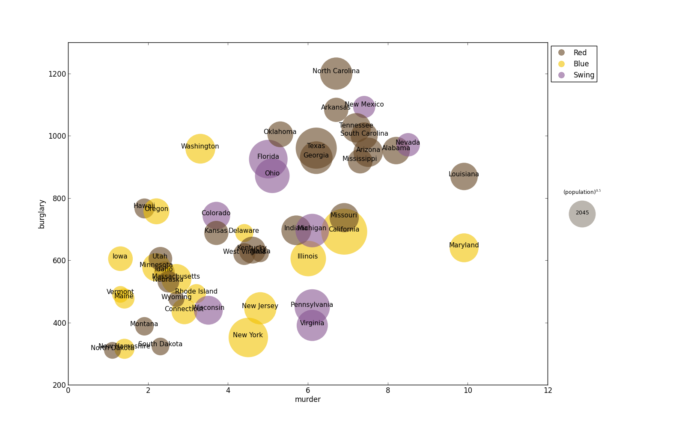

bubble.py facilitates plotting bubble plots, which are useful when you 
want to contrast two variables (X and Y) against a third variable (Z).

Require Python packages:
- `matplotlib`
- `numpy`
- `tsv`

============================================================================

#### Examples

+ Typical scatter plot:
```
	python bubble.py crimeRatesByState2005.csv murder burglary
```


+ Compare murder, burglary and population.  Transform population by a constant factor.
```
	python bubble.py crimeRatesByState2005.csv murder burglary population -t mul .0001
```


+ Adjust x/y ranges.
```
	python bubble.py crimeRatesByState2005.csv murder burglary population -t mul .0001 --ranges 0 12 200 1300
```


+ Add politics as a category.  Adjust legend.
```
python bubble.py crimeRatesByState2005.csv murder burglary population -t mul .0001 --ranges 0 12 200 1300  -c politics --legend_bubble 5 2 --legend 0.2 0 0
```
Note: in additional color codes, the legend also displays the median-size bubble, and indicates how Z is transformed.


+ Separate into groups based on politics (-g option is used).
```
python bubble.py crimeRatesByState2005.csv murder burglary population -t mul .0001 --ranges 0 12 200 1300 -g politics --legend_bubble 5 2 --legend 0.2 0 0
```


+ Label data point with state names.  Transform population with power 0.5. Resize figure to increase readability.
```
python bubble.py crimeRatesByState2005.csv murder burglary population --ranges 0 12 200 1300 -c politics --legend_bubble 5 3 --figsize 16 10 -l state -t pow 0.5
```


============================================================================

#### Usage
```
usage: bubble.py [-h] [-c Category] [-g Group] [-l Label] [-t transform value]
                 [--ranges xmin xmax ymin ymax] [--inc xinc yinc]
                 [--legend p left top] [--legend_bubble y spacing]
                 [--label_axes] [--scaled] [--figsize w h] [--alpha a]
                 [--margin m] [--output {png,pdf}] [--input_sep {,,	}]
                 data.csv X Y [Z]

Names of X, Y, Z, Category, Group, and Label must match with information
specified in the header of the input file.

positional arguments:
  data.csv              header must contain names of X, Y and optionally Z,
                        Category, Group, and Label.
  X
  Y
  Z                     optional, transformable, proportional to bubble areas.

optional arguments:
  -h, --help            show this help message and exit
  -c Category
  -g Group
  -l Label
  -t transform value    transform Z variable. Transform is one of {add, mul,
                        pow, log, exp}. Value is a float.
  --ranges xmin xmax ymin ymax
  --inc xinc yinc
  --legend p left top   p: figure portion given to legend; default is 0.1.
                        left: spacing between plot and legend; default: 0.
                        top: spacing between figure top & legend; default: 0.
  --legend_bubble y spacing
                        y: position of vertical bubble placement; default: 3.
                        spacing: no. of lines between annotations; default: 2.
  --label_axes          Turn on axes labels.
  --scaled              scaled x and y axes
  --figsize w h         figure width and height in inches; default: 8 6.
  --alpha a             bubble transparency; default: 0.6
  --margin m            plot margin; default: 0.1.
  --output {png,pdf}    format of output file; default: png
  --input_sep {,,	}     , or \t
```

============================================================================

#### Transformation of Z variable

Values of the Z variable (column) are equated to the areas of circles.  It is
sometimes desirable to transform the Z variable.  You need to specify that "-t" flag:

```
	-t transform value
```

Given a value v, each data point x of the Z variable is transformed based on the 
specified transformation as follows:

- add: x+v
- mul: x*v
- pow: x^v
- log: log_v (x)
- exp: v^x

Transformation must be done with care to ensure that the plot is not just pretty but also meaningful.
If the plot is too crowded, you can simply resize (with option --figsize or --ranges) instead of 
transforming the Z variable.

Transformation is chainable.  For example, to transform values x of Z to  3.14*x^2, simply use
option -t as follows:

```
	-t pow 2 -t mul 3.14
```
