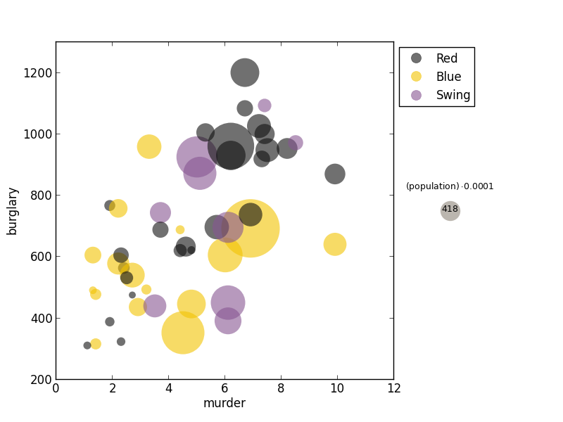

bubble.py facilitates plotting bubble plots, which are useful when you 
want to contrast two variables (X and Y) against a third variable (Z).

Require Python packages:
- `matplotlib`
- `numpy`
- `tsv`

============================================================================

#### Examples

+ Typical scatter plot:
```
	python bubble.py crimeRatesByState2005.csv murder burglary
```


+ Compare murder, burglary and population.  Transform population by a constant factor.
```
	python bubble.py crimeRatesByState2005.csv murder burglary population -t mul .0001
```


+ Readjust x/y ranges; turn on x/y labels
```
	python bubble.py crimeRatesByState2005.csv murder burglary population -t mul .0001 --ranges 0 12 200 1300 --label_axes
```


+ Add politics as a category.  Readjust legend.
```
python bubble.py crimeRatesByState2005.csv murder burglary population -t mul .0001 --ranges 0 12 200 1300 --label_axes -c politics --legend_bubble 5 2 --legend 0.2 0 0
```
Note: in additional color codes, the legend also displays the median-size bubble, and indicates if Z is transformed.


+ Separate into groups based on politics (-g option is used).
```
python bubble.py crimeRatesByState2005.csv murder burglary population -t mul .0001 --ranges 0 12 200 1300 --label_axes -g politics --legend_bubble 5 2 --legend 0.2 0 0
```


============================================================================

#### Usage
```
usage: bubble.py [-h] [-c Category] [-g Group] [-l Label] [-t transform value]
                 [--ranges xmin xmax ymin ymax] [--legend p left top]
                 [--legend_bubble y spacing] [--label_axes] [--figsize w h]
                 [--alpha a] [--margin m] [--output {png,pdf}]
                 data.csv X Y [Z]

Names of X, Y, Z, Category, Group, and Label must match with information
specified in the header of the input file.

positional arguments:
  data.csv              header must contain names of X, Y and optionally Z,
                        Category, Group, and Label.
  X
  Y
  Z                     optional, transformable, proportional to bubble areas.

optional arguments:
  -h, --help            show this help message and exit
  -c Category
  -g Group
  -l Label
  -t transform value    transform Z variable. Transform is one of {add, mul,
                        pow, log, exp}. Value is a float.
  --ranges xmin xmax ymin ymax
  --legend p left top   p: figure portion given to legend; default is 0.1.
                        left: spacing between plot and legend; default: 0.
                        top: spacing between figure top & legend; default: 0.
  --legend_bubble y spacing
                        y: position of vertical placement of bubble. Default:
                        3. spacing: number of lines between annotations.
  --label_axes          Turn on axes labels.
  --figsize w h         figure width and height in inches; default: 8 6.
  --alpha a             bubble transparency; default: 0.6
  --margin m            plot margin; default: 0.05.
  --output {png,pdf}    format of output file; default: png
```
